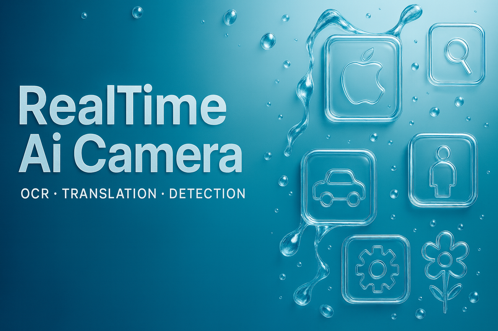
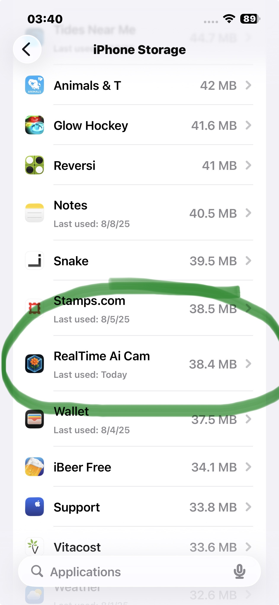
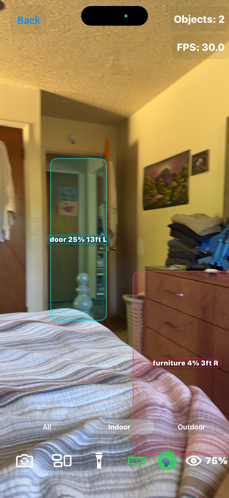

# ✨ RealTime AI Camera ✨

### 🚀 YOLOv8 with all 601 object classes on iPhone — runs at ~1–3 FPS depending on device

**🔥 Real-time Object Detection • OCR • Offline Translation • LiDAR Distance 🔥**  
Built specifically for **iPhone** • Works **100% offline** • Privacy-first design  

---

## 🌟 [🎨 Nice Dreamz apps product page →](https://nicedreamzwholesale.com/github-realtime-ai-camera/)  
*brought to you by NiceDreamzApps*

---

## 🏆 Project Status & Compatibility

---

## ✨ Core Features

- 🐶 **Object Detection** — YOLOv8 trained on **Open Images V7** (601 classes)  
- 📝 **English OCR** — On-device printed text recognition  
- 🌎 **Spanish → English Translation** — Offline, rule-based + dictionary  
- 📏 **LiDAR Distance** — Per-object depth on supported iPhones  
- 💝 **100% Free** — No ads, no in-app purchases, no subscriptions  
- 🔒 **Privacy-Focused** — No tracking, no servers, airplane-mode ready  
- ⚡ **Optimized for iPhone** — CoreML + Metal + Neural Engine acceleration  

---

## 🛠️ Technology Stack

- ⚡ CoreML + Metal + Neural Engine — Hardware-accelerated AI  
- 🏗️ SwiftUI — Native iOS interface  
- 🎯 YOLOv8 ([Ultralytics](https://github.com/ultralytics/ultralytics))  
- 📊 Open Images V7 — Comprehensive dataset  
- 🍎 Apple Frameworks — iOS native APIs  
- 🔋 Battery Optimization — Smart resource management  

---

## ⚡ Performance

- Real-time detection runs at **~1–3 FPS** depending on device and workload  
- Optimized with CoreML, Metal, and Neural Engine  
- Built-in battery and thermal safeguards  

---

## 🔒 Privacy Guarantee

✅ No data collection  
✅ No internet required  
✅ No location tracking  
✅ All on-device processing  

**🔐 Your privacy is non-negotiable.**

---

## 🚀 Getting Started

**Requirements**
- macOS + Xcode 16+  
- iOS 15+ (iPhone 12+ recommended)  
- LiDAR for depth features (Pro models)  

**Build Steps**
1. Clone this repository  
2. Open `RealTime Ai Cam.xcodeproj`  
3. Connect your iPhone  
4. Build & run  

**Permissions**
- Camera (required)  
- Microphone (voice features)  
- Motion/Depth (LiDAR)  

---

## 📸 Live Screenshots

| 🌎 Translation | 🐶 Detection | 🏠 Home | 📱 App Size | 📏 LiDAR |
| --- | --- | --- | --- | --- |
|  |  |  |  |  |

---

## 🔁 Model Replacement

Advanced users can replace the YOLOv8 `.mlpackage` in `/Models` with a custom CoreML model.  
Update `YOLOv8Processor.swift` if input/output shapes differ.  
Use **Git LFS** for large models.  

---

## 🤝 Contributing

Pull requests welcome! Please include:  
- Device + iOS version  
- Steps to reproduce  
- Logs / crash reports  
- Screenshots or video  

---

## 📄 License & Credits

**Dual-Licensed**:  

- **GPL-3.0** (open source use)  
- **Commercial License Required** for App Store, TestFlight, Google Play, or other commercial distribution  

Contact: 📧 [info@nicedreamzwholesale.com](mailto:info@nicedreamzwholesale.com)  

**Credits**  
- YOLOv8 — © Ultralytics (GPL-3.0)  
- Open Images V7 — © Google (CC BY 4.0)  
- CoreML, Metal, SwiftUI — © Apple Inc.  

---

### ⭐ If this project helped you, please give it a star! ⭐

