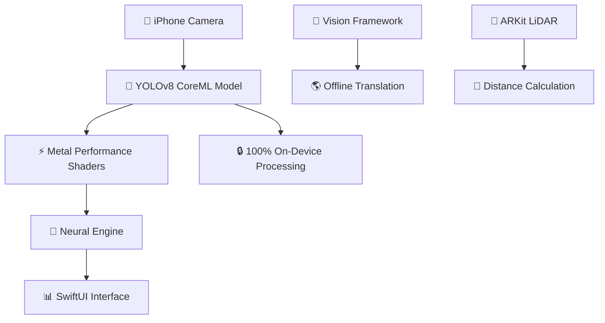

<div align="center">

# ✨ RealTime AI Camera ✨

### 🚀 YOLOv8 with all 601 object classes on iPhone — runs at **average 10 FPS**


**🔥 Real-time Object Detection • OCR • Offline Translation • LiDAR Distance 🔥**  
Built specifically for **iPhone** • Works **100% offline** • Privacy-first design  

---

## 🎉 **NOW AVAILABLE ON APP STORE - FREE DOWNLOAD!** 🎉

[](https://apps.apple.com/us/app/realtime-ai-cam/id6751230739)

</div>

---

<div align="center">

## 🌟 [🎨 Nice Dreamz Apps Product Page →](https://nicedreamzwholesale.com/github-realtime-ai-camera/)  
*Brought to you by NiceDreamzApps*

</div>

---

<div align="center">

## 🏆 Project Status & Performance

### 📱 **Platform & Compatibility**


### ⚡ **Performance & Features**


### 🛠️ **Technology Stack**


### 🔐 **Privacy & Licensing**


</div>

---

## ✨ Core Features

<table>
<tr>
<td width="50%">

### 🎯 **AI Computer Vision**
- 🐶 **Object Detection** — YOLOv8 with **601 classes** from Open Images V7
- 📝 **English OCR** — On-device printed text recognition  
- 🌎 **Spanish → English Translation** — Offline, rule-based + dictionary  
- 📏 **LiDAR Distance** — Per-object depth measurement on Pro models

</td>
<td width="50%">

### ⚡ **Performance & Privacy**
- 🚀 **Average 10 FPS** — Real-time processing across iPhone models
- 💝 **100% Free** — No ads, no in-app purchases, no subscriptions  
- 🔒 **Privacy-First** — No tracking, no servers, airplane-mode ready  
- 🍎 **iPhone Optimized** — CoreML + Metal + Neural Engine acceleration

</td>
</tr>
</table>

---

## ⚡ Performance Details

<div align="center">

**🏎️ Real-time Performance:** Average **10 FPS** across supported iPhone models

*Actual performance may vary based on scene complexity, device temperature, and background app activity*

</div>

**🚀 Optimization Features:**
- CoreML framework with Metal acceleration
- Neural Engine utilization on A12+ chips  
- Smart thermal and battery management
- Adaptive frame rate based on device capabilities

---

## 🛠️ Technology Stack

<div align="center">



</div>

| Component | Technology | Purpose |
|---|---|---|
| 🤖 **AI Model** | YOLOv8 (Ultralytics) | 601-class object detection |
| 🏗️ **UI Framework** | SwiftUI | Native iOS interface |
| ⚡ **Acceleration** | CoreML + Metal + Neural Engine | Hardware-optimized inference |
| 📊 **Dataset** | Open Images V7 | Comprehensive training data |
| 🍎 **Platform** | iOS 15+ Native APIs | Deep system integration |
| 🔋 **Optimization** | Smart resource management | Battery & thermal aware |

---

## 📱 Device Compatibility

<div align="center">

### ✅ **Supported iPhone Models**
- iPhone X and newer (iOS 15+ required)
- Optimized for all compatible devices
- LiDAR features available on Pro models with depth sensor

**💡 Note:** iPhone 12+ models may offer enhanced performance due to improved Neural Engine and thermal design, but the app runs well across all supported devices.

</div>

---

## 🔒 Privacy Guarantee

<div align="center">

### 🛡️ **Your Data Never Leaves Your Device**

| Privacy Feature | Status | Description |
|---|---|---|
| 📊 **Data Collection** | ❌ **NONE** | Zero telemetry or analytics |
| 🌐 **Internet Required** | ❌ **NO** | Works in airplane mode |
| 📍 **Location Tracking** | ❌ **NEVER** | No GPS or location access |
| 🏢 **Cloud Processing** | ❌ **NONE** | 100% on-device AI |
| 🔐 **Data Encryption** | ✅ **Built-in** | iOS secure enclave protection |

</div>

**🔐 Your privacy is non-negotiable. Everything happens locally on your iPhone.**

---

## 📸 Live Screenshots

<div align="center">

### 🖼️ **See RealTime AI Camera in Action**

| 🌎 **Translation** | 🐶 **Detection** | 🏠 **Home Screen** | 📱 **App Info** | 📏 **LiDAR Distance** |
| --- | --- | --- | --- | --- |
|  |  |  |  |  |
| *Offline Spanish→English* | *601 object classes* | *Clean, native UI* | *Lightweight install* | *Pro model depth sensing* |

</div>

---

## 🚀 Getting Started

### 📋 **Requirements**
- **Development:** macOS with Xcode 16+  
- **Device:** iPhone X+ with iOS 15+ (iPhone 12+ recommended for optimal performance)  
- **Optional:** LiDAR-enabled iPhone for distance measurement features  

### ⚙️ **Quick Setup**
```bash
# 1. Clone the repository
git clone https://github.com/nicedreamzapp/nicedreamzapp.git

# 2. Navigate to project
cd nicedreamzapp

# 3. Open in Xcode
open "RealTime Ai Cam.xcodeproj"

# 4. Connect your iPhone and build!
```

### 🔑 **Required Permissions**
- 📷 **Camera** (required for object detection)  
- 🎤 **Microphone** (optional, for voice features)  
- 📐 **Motion/Depth** (optional, for LiDAR distance measurement)  

---

## 🔧 Advanced Customization

<details>
<summary>🤖 <strong>Custom Model Replacement</strong> (Click to expand)</summary>

### 📦 **Replace YOLOv8 Model**

Advanced users can swap the included YOLOv8 model with a custom CoreML model:

1. **Replace Model File**
   ```
   /Models/YOLOv8.mlpackage  →  YourCustomModel.mlpackage
   ```

2. **Update Processor**
   - Modify `YOLOv8Processor.swift` if input/output shapes differ
   - Adjust class labels in the configuration

3. **Large Models**
   - Use **Git LFS** for models >100MB
   - Consider model quantization for better performance

### ⚡ **Performance Tuning**
- Adjust inference frequency in `CameraViewController.swift`
- Modify confidence thresholds for different use cases
- Enable/disable features based on device capabilities

</details>

---

## 🤝 Contributing

<div align="center">

### 🌟 **We Welcome Contributions!** 🌟

</div>

**📝 Before submitting a PR, please include:**
- 📱 Device model + iOS version tested
- 🔄 Steps to reproduce any issues  
- 📋 Crash logs or error messages (if applicable)
- 📸 Screenshots or video demonstration
- 🧪 Test results on different device configurations

**🎯 Areas where we'd love help:**
- 🌍 Additional language support for translation
- 🎨 UI/UX improvements
- ⚡ Performance optimizations  
- 🐛 Bug fixes and stability improvements
- 📚 Documentation enhancements

---

## 📞 Support & Contact

<div align="center">

### 💬 **Need Help?**

[](mailto:info@nicedreamzwholesale.com)
[](https://nicedreamzwholesale.com/github-realtime-ai-camera/)

</div>

---

## 📄 License & Credits

### ⚖️ **Dual License**

- **🔓 GPL-3.0** — For open source development and learning
- **💼 Commercial License** — Required for App Store, TestFlight, or commercial distribution

**📧 Commercial licensing:** [info@nicedreamzwholesale.com](mailto:info@nicedreamzwholesale.com)

### 🙏 **Acknowledgments**

| Component | Creator | License |
|---|---|---|
| 🤖 **YOLOv8** | © Ultralytics | GPL-3.0 |
| 📊 **Open Images V7** | © Google | CC BY 4.0 |
| 🍎 **CoreML, Metal, SwiftUI** | © Apple Inc. | Apple Developer Agreement |
| 🎨 **App Design & Development** | © NiceDreamzApps | GPL-3.0 |

---

<div align="center">

## 🌟 **Show Your Support** 🌟

### If this project helped you, please give it a star! ⭐

[](https://apps.apple.com/us/app/realtime-ai-cam/id6751230739)
[](https://github.com/nicedreamzapp/nicedreamzapp)
[](https://github.com/nicedreamzapp/nicedreamzapp/fork)

### 🚀 **Made with ❤️ by NiceDreamzApps**

</div>

---

<div align="center">
<sub>© 2025 RealTime AI Camera • Open Source • Privacy-First • iPhone Optimized</sub>
</div>
